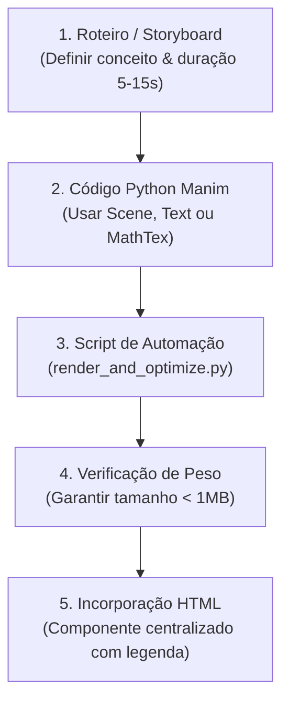

# Didactic Manim Video (Animações Matemáticas Didáticas com Manim e FFmpeg)

Esta skill estabelece o fluxo de trabalho canônico para conceber, programar, renderizar e otimizar demonstrações visuais e animações matemáticas em vídeo para o ecossistema DataLab.

---

## 1. Princípios de Concepção e UX Didática

1. **Foco Único e Cenas Curtas (Micro-Animações):**
   - Cada clipe deve ilustrar **exatamente um fenômeno ou intuição** (ex: o cisalhamento de uma malha, a projeção de uma sombra ortogonal, o afunilamento de uma distribuição).
   - A duração ideal é entre **5 e 15 segundos**. Evite sequências longas ou complexas que sobrecarreguem o leitor.
   - Elimine tempos mortos: transições devem durar de 0.8s a 1.5s, com pausas reflexivas (`self.wait`) de no máximo 1.0s a 1.5s no ápice da demonstração.

2. **Otimização Contínua de Peso (FFmpeg Obrigatório):**
   - Nunca utilize o arquivo `.mp4` bruto gerado pelo Manim diretamente na web (geralmente pesa entre 3MB e 15MB).
   - Todo vídeo deve ser obrigatoriamente pós-processado pelo FFmpeg com H.264, CRF 26, perfil `yuv420p` e `+faststart`, reduzindo o tamanho em até 90% (típico: 200KB a 800KB).

3. **Padrão Estético de Apresentação:**
   - Centralizado na página com margens verticais (`my-6`).
   - Container `max-w-xl aspect-video` com bordas levemente arredondadas (`rounded-xl`).
   - Borda sutil neutra (`border border-slate-200 dark:border-slate-800`).
   - Reprodução automática, em loop contínuo e sem som (`autoplay loop muted playsinline`).
   - Legenda explicativa concisa e didática imediatamente abaixo (`<figcaption>`).

4. **Enquadramento Pleno e Tipografia para Web:**
   - **Zero Bordas Pretas:** O Manim opera em 16:9 (largura ~14.22, altura ~8.0). Sempre dimensione a malha/eixos (`NumberPlane` ou `Axes`) para ocupar de 12.5 a 13.8 unidades de largura e de 6.0 a 6.8 unidades de altura, eliminando áreas mortas e bordas pretas espessas.
   - **Tipografia Ampliada:** Para legibilidade impecável em monitores e telas mobile, use:
     * Título principal: `font_size=32` a `36` (peso `BOLD`).
     * Subtítulos / Fórmulas: `font_size=22` a `26`.
     * Rótulos de vetores e dados: `font_size=22` a `26` (peso `BOLD`).
     * Traço dos vetores: `stroke_width=6` a `8`.

---

## 2. Fluxo Procedural Passo a Passo



### Passo 1: Elaborar a Cena Python do Manim

Crie um arquivo Python com a classe que herda de `Scene`.

*   **Texto & Tipografia Matemática:**
    *   **Padrão Obrigatório:** Utilize `MarkupText("<i>c</i><sub>1</sub> <b>u</b> + <i>c</i><sub>2</sub> <b>v</b>")` para fórmulas e termos matemáticos. Suporta subscritos (`<sub>`), sobrescritos (`<sup>`), itálicos (`<i>`) e negritos (`<b>`) de forma 100% nativa via Pango, sem depender de LaTeX externo.
    *   Utilize `Text("Texto puro", font_size=...)` para títulos simples e rótulos genéricos.
    *   Evite `MathTex` a menos que o ambiente possua compilador LaTeX (`pdflatex`/`dvisvgm`) confirmado.
*   **Consultas de Referência:**
    *   Consulte [Guia Rápido do Manim](./references/manim_cheat_sheet.md) para mobjects, cores e animações.
    *   Veja exemplos funcionais em [Exemplo: Transformação Linear 2D](./examples/linear_transformation_scene.py) e [Exemplo: Teorema Central do Limite](./examples/central_limit_scene.py).

### Passo 2: Executar a Renderização e Otimização Automatizada

Utilize o script utilitário empacotado nesta skill:
[`scripts/render_and_optimize.py`](./scripts/render_and_optimize.py)

```bash
python .agents/skills/didactic-manim-video/scripts/render_and_optimize.py \
  --file caminho/para/sua_cena.py \
  --scene NomeDaClasseDaCena \
  --quality medium \
  --output datascience/assets/videos \
  --caption "Descrição didática curta da animação."
```

#### Parâmetros do Script:
*   `--quality`:
    *   `medium` (Padrão): 720p @ 30fps. Ideal para a maioria das animações web.
    *   `low`: 480p @ 15fps. Para protótipos ultraleves (<200KB).
    *   `high`: 1080p @ 60fps. Apenas para materiais de alta resolução explícitos.
*   `--crf`: Nível de compressão FFmpeg (padrão: `26`).
*   `--output`: Diretório onde o `.mp4` otimizado final será gravado.

O script automaticamente:
1. Detecta o binário do `ffmpeg` no sistema (PATH, Shotcut, Krita, etc.).
2. Executa a compilação no Manim.
3. Aplica a transcodificação H.264 otimizada.
4. Exibe métricas de redução de tamanho.
5. Imprime o snippet HTML pronto para uso.

Consulte a [Documentação de Otimização FFmpeg](./references/ffmpeg_optimization.md) para detalhes técnicos dos parâmetros.

---

## 3. Padrão de Incorporação HTML no DataLab

Sempre incorpore os vídeos no corpo dos capítulos ou módulos utilizando o seguinte template estruturado:

```html
<!-- Componente Didático de Vídeo (DataLab / Manim) -->
<figure class="flex flex-col items-center justify-center my-6">
  <div class="w-full max-w-xl aspect-video overflow-hidden rounded-xl border border-slate-200 dark:border-slate-800 shadow-sm bg-slate-950">
    <video controls autoplay loop muted playsinline class="w-full h-full object-cover block">
      <source src="assets/videos/nome_do_video.mp4" type="video/mp4">
      Seu navegador não suporta a tag de vídeo.
    </video>
  </div>
  <figcaption class="mt-2 text-center text-xs text-slate-500 dark:text-slate-400 font-medium max-w-md">
    Vetor de entrada $\mathbf{v}$ sendo mapeado e rotacionado pela matriz de transformação $\mathbf{A}$.
  </figcaption>
</figure>
```

---

## 4. Checklist de Qualidade Antes de Publicar

- [ ] **Duração Curta:** O vídeo dura entre 5 e 15 segundos sem pausas longas ou desnecessárias?
- [ ] **Foco Conceitual:** Demonstra de forma nítida exatamente um conceito ou intuição?
- [ ] **Enquadramento 16:9 Pleno:** O conteúdo preenche o campo de visão (~13.5 x ~6.8 unidades), sem bordas pretas espessas ou letterboxing vazio?
- [ ] **Tipografia Legível:** As fontes possuem tamanhos confortáveis (`font_size >= 24` para rótulos/fórmulas e `font_size >= 32` para títulos)?
- [ ] **Otimização FFmpeg:** O vídeo foi compactado com H.264 (`-c:v libx264 -crf 26 -pix_fmt yuv420p -an -movflags +faststart`)?
- [ ] **Tamanho Controlado:** O arquivo final possui tamanho inferior a 1 MB?
- [ ] **Layout Centrado:** O componente de vídeo possui `flex flex-col items-center justify-center my-6`?
- [ ] **Aspect Ratio Perfeito:** O container possui `max-w-xl aspect-video rounded-xl` sem barras extras?
- [ ] **Legenda Didática:** Consta uma legenda descritiva curta (<figcaption>) explicando o fenômeno observado?
- [ ] **Atributos de Reprodução:** A tag `<video>` inclui `controls autoplay loop muted playsinline`?
