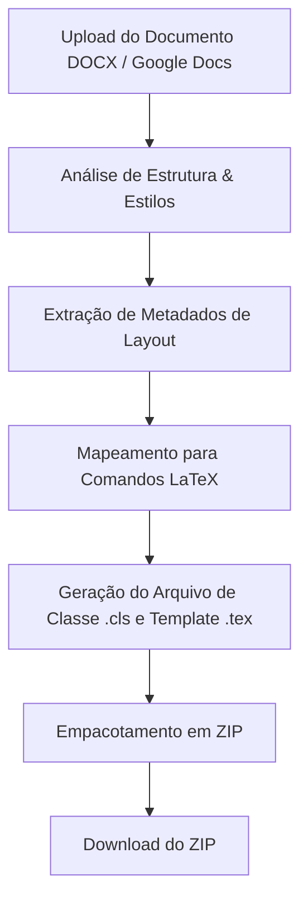

# DocToTex - Visão Geral do Projeto

O **DocToTex** é uma ferramenta projetada para analisar a estrutura e a identidade visual de documentos gerados no Microsoft Word (.docx) ou no Google Docs, extraindo seus estilos de formatação e gerando de forma automática um modelo LaTeX idêntico (ou o mais próximo possível) em formato ZIP.

---

## 1. Fluxo de Funcionamento Proposto

1. **Entrada**: Upload de um arquivo `.docx` ou integração/exportação de um Google Doc.
2. **Processamento**:
   - Varredura da estrutura do documento (parágrafos, cabeçalhos, rodapés, margens, fontes, cores, espaçamentos).
   - Extração do mapa de estilos (Heading 1, Heading 2, Body Text, Listas, etc.).
3. **Tradução**:
   - Conversão das propriedades visuais em comandos e pacotes LaTeX (ex: `geometry` para margens, `titlesec` para títulos, `fancyhdr` para cabeçalhos e rodapés).
4. **Saída**: Criação de um arquivo ZIP contendo:
   - Uma classe LaTeX customizada (`doctotex.cls`) com a definição visual.
   - Um arquivo estrutural (`main.tex`) demonstrando o uso dos estilos.
   - Recursos adicionais (imagens de cabeçalho, arquivos de fontes, se aplicável).

---

## 2. Escopo do MVP (Mínimo Produto Viável)

Para a primeira versão, sugere-se focar nos seguintes elementos de formatação:
* **Configurações de Página**: Tamanho da folha (A4/Letter), margens (superior, inferior, esquerda, direita) e orientação.
* **Tipografia básica**: Tamanhos de fonte, espaçamento entre linhas e alinhamento de texto (justificado, esquerda, etc.).
* **Hierarquia de Cabeçalhos**: Formatação de Títulos (H1, H2, H3) incluindo tamanho, cor e espaçamento antes/depois.
* **Cabeçalhos e Rodapés**: Textos repetitivos nas páginas e numeração.
* **Listas**: Marcadores (bullets) e listas numeradas básicas.

---

## 3. Perguntas para Amadurecimento da Ideia

Para avançarmos com o rascunho e a implementação do DocToTex, precisamos detalhar alguns pontos práticos:

### Q1. Interface e Hospedagem
* **Como o usuário interagirá com a ferramenta?**
  1. Uma aplicação web moderna (React/Next.js/HTML+JS) onde ele arrasta o arquivo e baixa o ZIP.
  2. Uma ferramenta de linha de comando (CLI) focada em desenvolvedores e automação.
  3. Uma extensão/add-on direto dentro do Google Docs.

### Q2. Mecanismo de Entrada
* **Como faremos a leitura do Google Docs?**
  1. O usuário faz download do Google Doc como `.docx` e faz o upload desse arquivo na ferramenta (simplifica o desenvolvimento, unificando a entrada).
  2. Conexão direta com a Google Docs API (exige login com conta Google e gerenciamento de tokens OAuth).

### Q3. Motor de Compilação LaTeX e Fontes
* **Qual compilador LaTeX padrão o template deve visar?**
  1. **pdfLaTeX**: Mais comum e tradicional, mas limitado no uso de fontes TrueType/OpenType (requer conversão de fontes).
  2. **XeLaTeX / LuaLaTeX**: Permite carregar diretamente fontes instaladas no sistema (ex: Arial, Times New Roman, Calibri) usando o pacote `fontspec` (recomendado para manter a fidelidade visual idêntica).

### Q4. Estrutura do ZIP Gerado
* **Qual é o formato preferencial do arquivo LaTeX gerado?**
  1. Uma classe customizada `.cls` (doctotex.cls) contendo os estilos + um `main.tex` limpo contendo apenas o conteúdo do documento original.
  2. Um único arquivo `main.tex` com todo o preâmbulo de estilos no início e o conteúdo logo em seguida.

### Q5. Elementos Avançados (Fases Futuras)
* **Como devemos tratar elementos complexos caso existam no documento original?**
  - **Tabelas**: Gerar tabelas LaTeX dinâmicas (utilizando `booktabs` / `tabularx`) com cores de fundo idênticas?
  - **Imagens**: Extrair as imagens do DOCX, salvá-las no ZIP e gerar as tags `\includegraphics` correspondentes no LaTeX?
  - **Equações**: Converter equações nativas do Word (OMML) para código matemático LaTeX?
