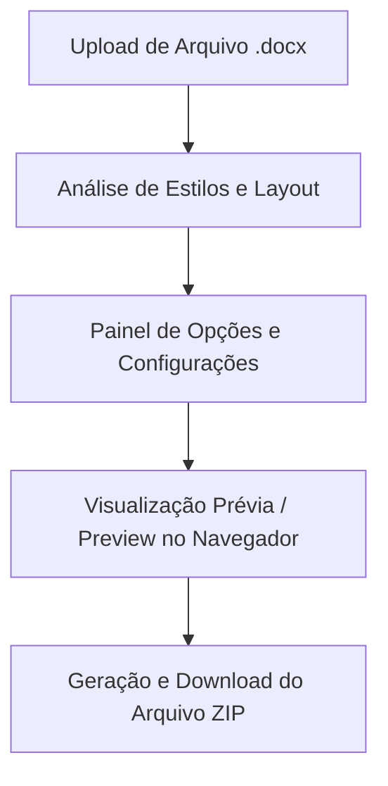

# DocToTex - Especificação do Projeto

O **DocToTex** é uma aplicação web voltada para a análise da estrutura e identidade visual de arquivos do Microsoft Word (.docx) ou Google Docs (baixados como .docx), extraindo seus estilos de formatação e gerando de forma automática um modelo LaTeX equivalente em um arquivo compactado (ZIP).

---

## 1. Fluxo de Funcionamento e Arquitetura

1. **Entrada de Dados (Upload)**:
   - O usuário faz o download do seu documento do Google Docs ou Word no formato `.docx` e realiza o upload na aplicação web.
2. **Extração e Análise**:
   - Varredura interna do XML do arquivo `.docx` para mapear: margens, orientação da folha, tipografia (fontes, tamanhos, espaçamento), cores, cabeçalhos/rodapés e hierarquia de títulos.
   - Extração de imagens e conversão de tabelas e fórmulas matemáticas.
3. **Painel de Configuração (Opções Extras)**:
   - Antes da geração do arquivo final, o usuário pode configurar opções extras, como a inclusão de pacotes para referências científicas e citações (ex: `biblatex` ou `natbib` com suporte a estilos como APA, IEEE, ABNT).
4. **Visualização Prévia (Preview)**:
   - Exibição de um preview do LaTeX gerado diretamente no navegador.
   - **Renderização no Navegador**:
     - *Visualização de Código*: Visualizador interativo com destaque de sintaxe (ex: Prism.js ou Monaco Editor) mostrando o arquivo de classe (`.cls`) e o arquivo principal (`.tex`).
     - *Visualização de Layout*: Tradução dos estilos para HTML/CSS correspondente para uma prévia visual rápida, ou compilação client-side via WebAssembly (como o **SwiftLaTeX**) / renderização de equações com **KaTeX**/**MathJax**.
5. **Geração do ZIP**:
   - Criação e compactação do template de saída conforme as preferências selecionadas.

---

## 2. Decisões de Design e Tecnologia

### Interface e Hospedagem
* **Plataforma**: Aplicação Web responsiva seguindo a identidade estética premium do laboratório (layout moderno, micro-transições, paleta de cores harmoniosa).
* **Upload**: Fluxo local e direto via upload de arquivo `.docx`. Evita complexidades iniciais de autenticação OAuth com a API do Google Docs.

### Estrutura do LaTeX Gerado (Opção do Usuário)
* **Formato Padrão (MVP)**: Separação estrutural clara. O ZIP conterá:
  - `doctotex.cls`: Arquivo de classe customizado contendo todas as definições visuais (margens, fontes, estilos de títulos, cabeçalho/rodapé).
  - `main.tex`: Arquivo principal limpo, contendo apenas o texto estruturado com os comandos da classe customizada.
* **Formato Alternativo**: Um único arquivo `main.tex` contendo todas as definições no preâmbulo (útil para submissões rápidas que exigem arquivo único).

### Motor de Compilação e Fontes
* **Opção de Compilador**: O painel de configuração permitirá ao usuário escolher o compilador desejado:
  - **pdfLaTeX**: Padrão do MVP. Efetivo e amplamente compatível.
  - **XeLaTeX / LuaLaTeX**: Para suporte avançado a fontes do sistema (como Arial, Times New Roman, Calibri) usando o pacote `fontspec`.

### Suporte a Elementos Avançados
* **Tabelas**: Conversão automatizada de tabelas DOCX para ambientes de tabelas LaTeX (`booktabs`, `tabularx`), preservando cores de fundo e bordas básicas.
* **Imagens**: Extração das imagens inseridas no documento original para uma pasta `images/` no ZIP, gerando os respectivos comandos `\includegraphics` no corpo do documento.
* **Equações**: Conversão de fórmulas matemáticas nativas do Word (formato OMML) para notação matemática LaTeX (`$ ... $` ou `\begin{equation} ... \end{equation}`).

---

## 3. Tecnologias Recomendadas para o Preview no Navegador

Para implementar o preview interativo do LaTeX no navegador antes do download, usaremos uma combinação das seguintes bibliotecas:

| Biblioteca | Função | Vantagem para o DocToTex |
| :--- | :--- | :--- |
| **Monaco Editor / Prism.js** | Visualização e Edição de Código | Permite ao usuário inspecionar e fazer pequenos ajustes no código do `doctotex.cls` e `main.tex` gerados antes de baixar. |
| **KaTeX** | Renderização de Expressões Matemáticas | Rápida e leve, ideal para mostrar equações matemáticas formatadas no preview visual. |
| **LaTeX.js** / **SwiftLaTeX (Wasm)** | Renderização de Layout | O **LaTeX.js** traduz o código LaTeX diretamente em elementos HTML5/CSS para uma prévia rápida, enquanto o **SwiftLaTeX** permite compilação real para PDF no navegador. |
